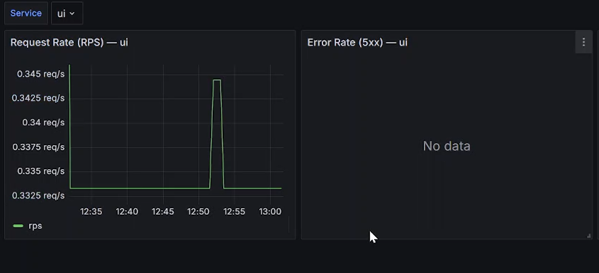
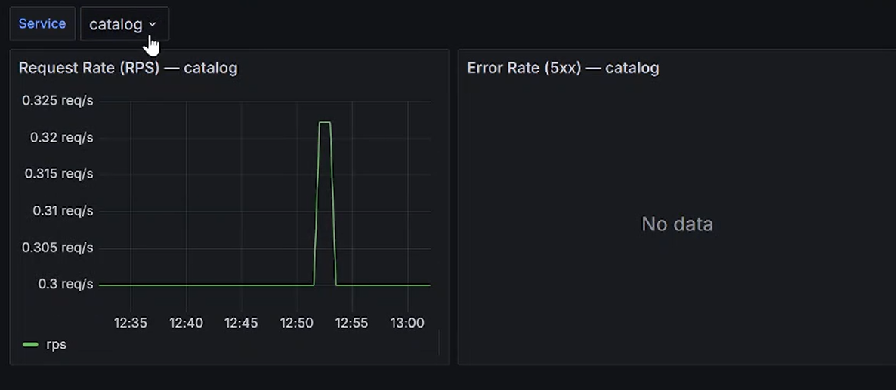
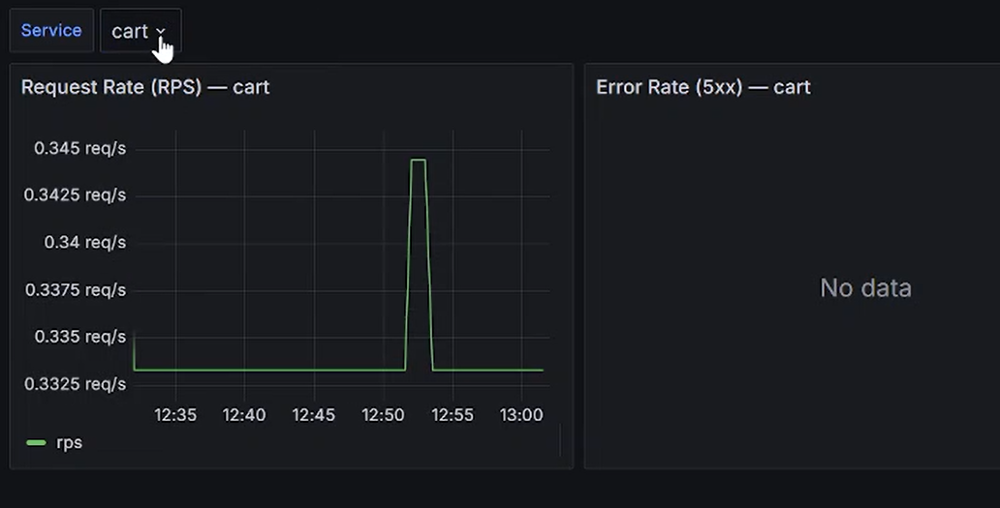
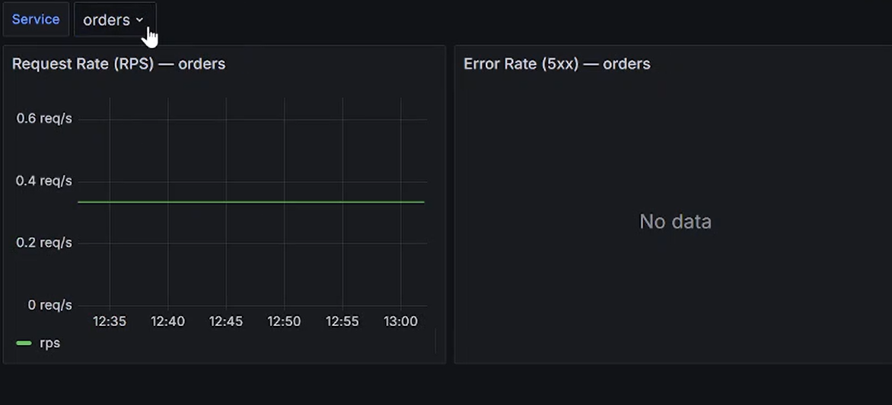
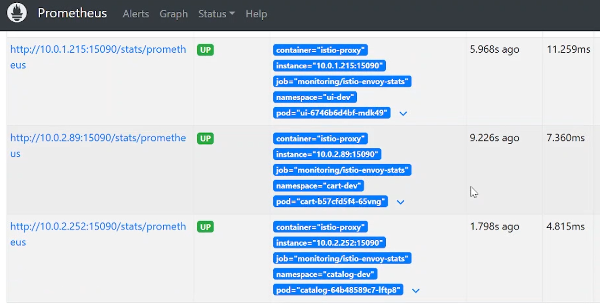
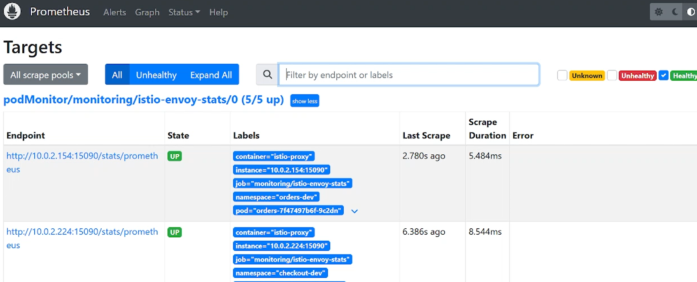
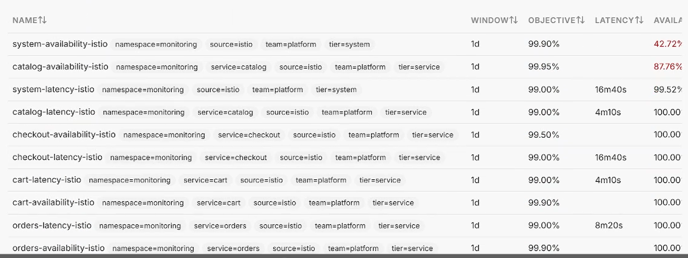
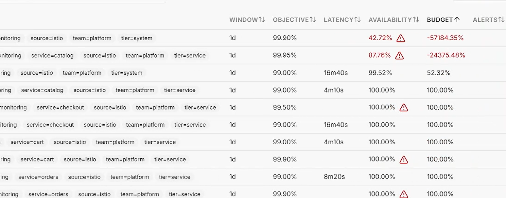

# 01 — When traffic first flows

The cluster just came up. No load test yet. I expected things to be quiet — instead
Slack lit up with critical alerts. This is the story of why that happens, and why it
isn't actually a problem.

## There's barely any traffic

Around 12:30 every service is sitting at about **0.3 req/s**. That's not real users —
it's just health checks and Istio probes ticking over. Nothing is really being used yet.

Look at the Error Rate panels — they say **"No data"**. That doesn't mean zero errors.
It means there are so few requests there's nothing to calculate an error rate from.

## Prometheus is fine

All five Istio sidecars are up and being scraped (`5/5 up`). So the monitoring itself
is working — that's not where the noise is coming from.

## The SLO numbers look insane

- `system-availability-istio`: **42.72%** available, budget **−57,184%**
- `catalog-availability-istio`: **87.76%**, budget **−24,375%**
- Everything else: 100%.

A budget of minus fifty-seven thousand percent looks broken. It isn't. Here's what's
going on: burn rate is basically *how bad the failures are* divided by *how many you're
allowed*. When there's almost no traffic, even two or three failed requests during
startup (sidecars still warming up, pods not quite ready) look like a massive failure
rate — because there's nothing good to balance them out. Divide that by a tiny 0.1%
budget and you get a number in the thousands.

The window here is 1 day. I picked 1 day on purpose so the burn shows up fast and I can
see it during a demo. A real production SLO uses something like 28 days — and on a 28-day
window these same few failures would barely move the needle.

## And that's why Slack is shouting

On top of the low-traffic burn, Pyrra also fires `SLOMetricAbsent` when its queries find
no data yet — which happens right at startup before the metrics fill in. Put those
together and a perfectly healthy, just-booted cluster throws a pile of critical-looking
alerts.

## So what did I learn?

At low traffic, these alerts lie. A few requests is not enough to judge anything. This is
exactly the false alarm that multi-window burn-rate alerting is meant to catch — and the
fix is simple: send real traffic. That's the next chapter, where the budgets climb back
to healthy on their own.
