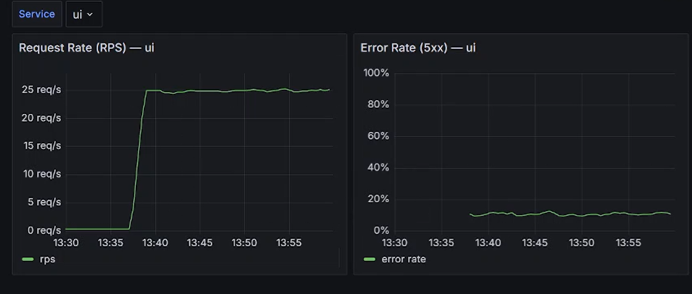
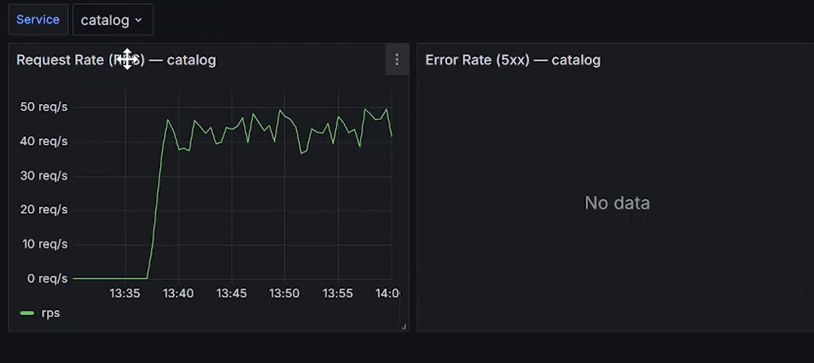
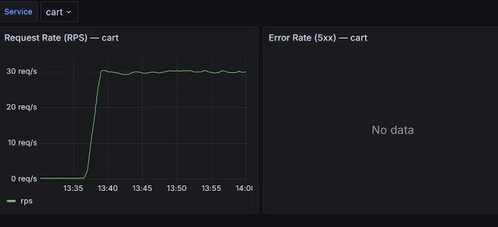
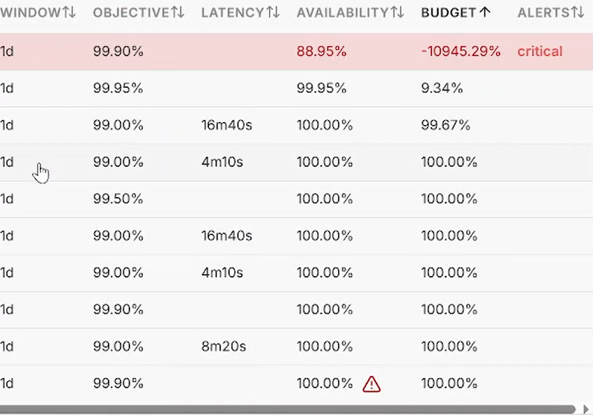
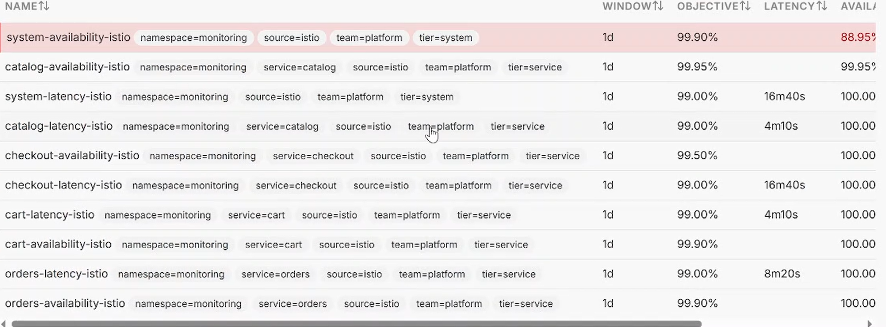
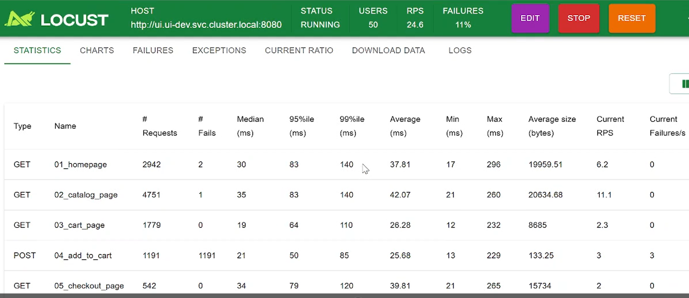
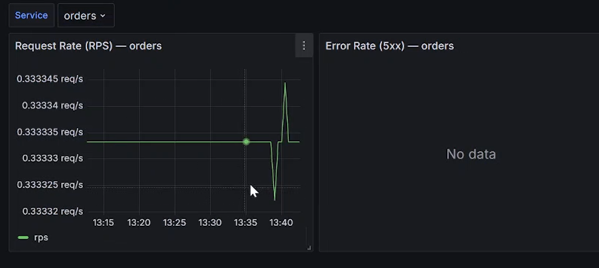
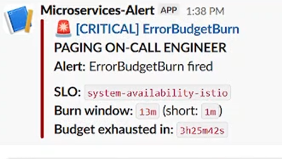

# 02 — Turning on real traffic with Locust

In the last chapter the cluster was barely doing anything and the SLOs looked like
the world was ending. The fix was simple: send real traffic. I started Locust at
50 users and watched what happened.

## Traffic jumps

Around 13:35–13:40 you can see the load kick in. UI goes from 0.3 req/s up to ~25,
catalog to ~45, cart to ~30. This is real load now, not just health checks.

## The budgets recover on their own

This is the part I wanted to see. Same SLOs, same cluster — but the moment real
traffic flows, the budgets start climbing back toward healthy. The afternoon's failures
get drowned out by all the new successful requests.

The numbers are still negative (system budget around −10,945% here), but that's
expected. The window is 1 day, so it still "remembers" this afternoon's mess — a rolling
window heals slowly. It's clearly recovering, just not instantly. On a 28-day window
this afternoon's blip would barely have shown up at all.

## But wait — there's an 11% failure rate

Locust says FAILURES 11%. That looks bad. So I dug into the per-request breakdown:

- `01_homepage`: 2942 requests, 2 fails
- `02_catalog_page`: 4751 requests, 1 fail
- `03_cart_page`: 1779 requests, 0 fails
- `04_add_to_cart` (POST): **1191 requests, 1191 fails** — every single one
- `05_checkout_page`: 542 requests, 0 fails

Every failure is `add_to_cart`, and it fails 100% of the time. That's not the cart
service breaking. It's my load test sending a bad request — the POST is missing the
CSRF token / session / Content-Type that the Spring Boot UI expects, so the UI rejects
every one. Add to cart works fine in a real browser. The "11%" is a broken test
request, not a broken platform.

## Why orders stays flat

Orders barely moves. That makes sense once you know add_to_cart is failing — orders
only gets traffic when someone completes a checkout, and the journey never gets that
far because nothing ever lands in the cart. So orders only sees health-check traffic.
Another confirmation it's the test that's broken, not the app.

## The Slack alert

A few minutes after traffic started, a critical `ErrorBudgetBurn` landed for
`system-availability-istio`. This one is partly real: those failed add_to_cart POSTs
are genuine 5xx hitting the UI's metrics, which drags system-availability down and
makes the UI error-rate panel creep up. So the alert isn't pure noise this time —
it's reacting to my own broken test traffic.

## So what did I learn?

Two things. First, real traffic fixes the low-volume false alarms — the budgets
recover on their own. Second, always look at *which* requests are failing before you
panic at an aggregate number. A scary 11% turned out to be one broken request type,
not a platform problem. Next chapter: I disable that broken request so I have a clean
baseline before injecting real faults.
