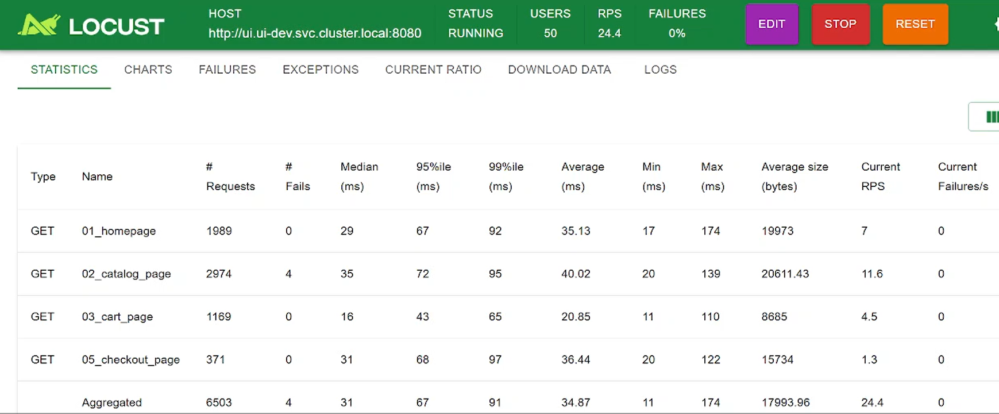
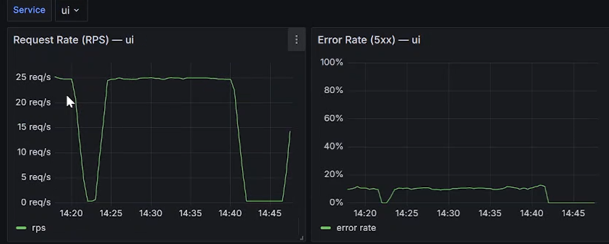
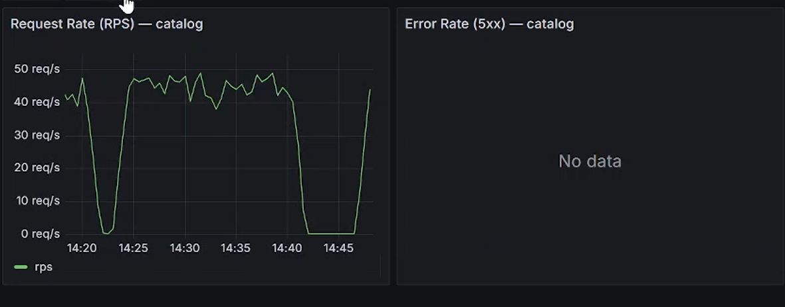
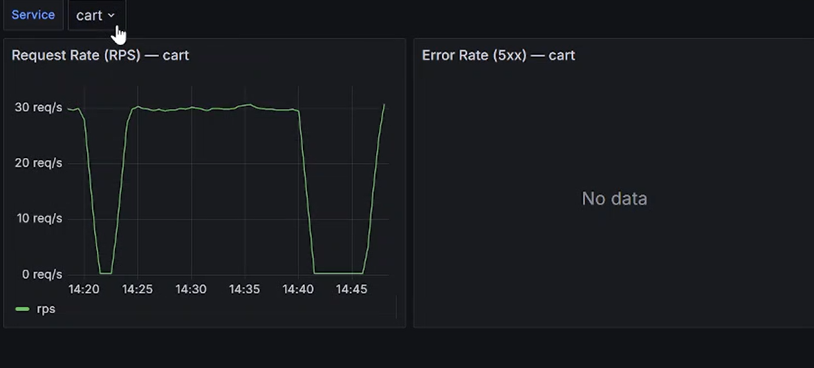
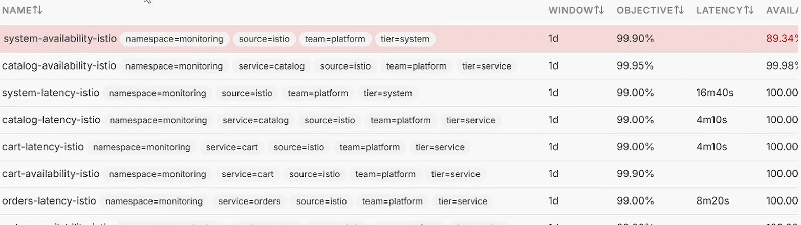
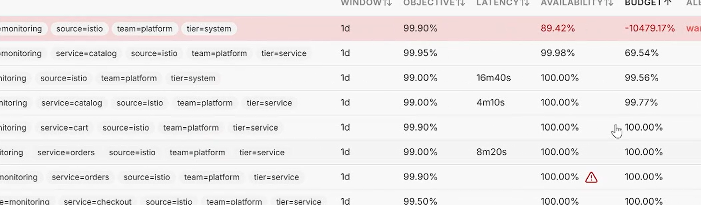
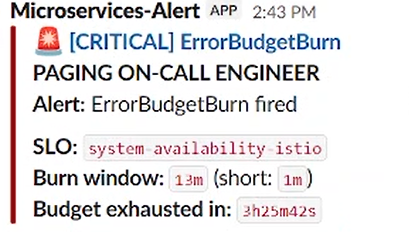

# 03 — Cleaning up the load test for a clean baseline

Last chapter I found that the scary 11% failure rate was one broken request:
`add_to_cart`, failing 100% of the time because the POST was missing the headers the
UI expects. Before I inject any real faults, I want a clean baseline — otherwise that
broken request would muddy every result. So I disabled it.

## The fix

The load test runs from a locustfile stored in a ConfigMap. I set the `add_to_cart`
task weight to 0 so Locust never calls it, committed the change, and restarted the
Locust pod so it picked up the new file.

## Locust is now clean — 0% failures

Now the numbers look like a healthy store under load:

- `01_homepage`: 1989 requests, 0 fails
- `02_catalog_page`: 2974 requests, 4 fails (0.1% — trivial)
- `03_cart_page`: 1169 requests, 0 fails
- `05_checkout_page`: 371 requests, 0 fails
- **Aggregate: 6503 requests, 4 fails ≈ 0.06%**

And notice `add_to_cart` is gone from the list entirely — that's what weight 0 does,
the task just never gets picked.

## No errors anywhere

With the broken request gone, the error-rate panels are flat across the board. (The
dips to 0 req/s you see are just me restarting Locust to apply the change — not an
outage.)

## SLOs still healing

Catalog availability is back to 99.98% and its budget has gone positive (~69%).
System is still negative (~−10,479%) but clearly draining — the 1d window is still
carrying this afternoons's cold-start mess and just needs more time for it to age out.

## The alert is downgrading

The Slack alerts show the multi-window pattern doing its job — the fast-burn (1m/13m)
critical that fired during the cold start, with the slower window still lingering as
things recover. The system is healthy right now; the alert is catching up.

## So what did I learn?

A load test is only useful if it sends valid requests — one broken request type made
the whole platform look 11% unhealthy when it was fine. With that cleaned up, I have a
trustworthy 0%-failure baseline. Now any errors I see in the next chapter come from the
fault I inject on purpose, not from a noisy test. That's the whole point of getting a
clean baseline before doing chaos engineering.
