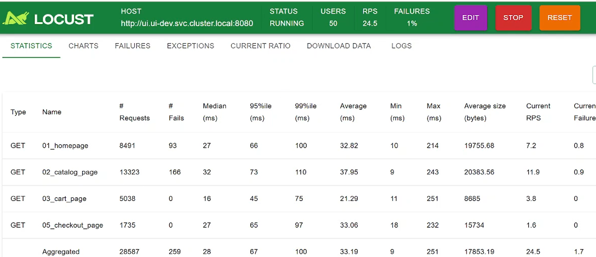
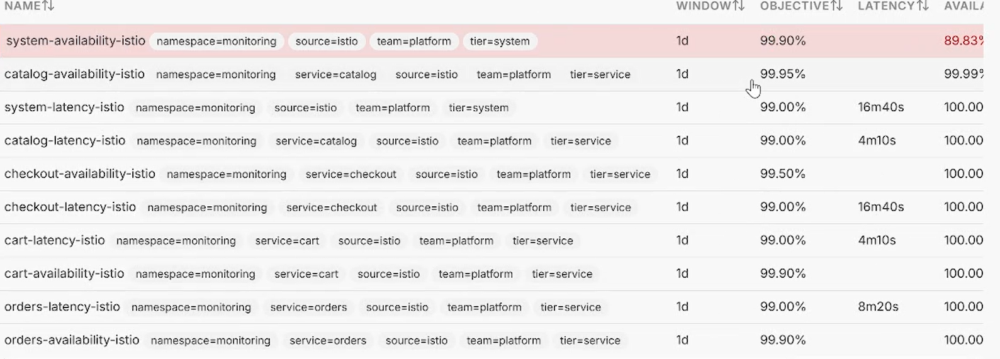
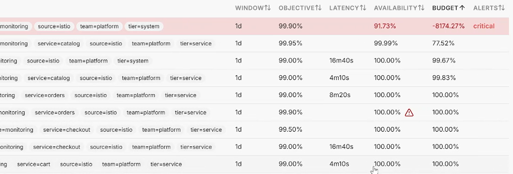
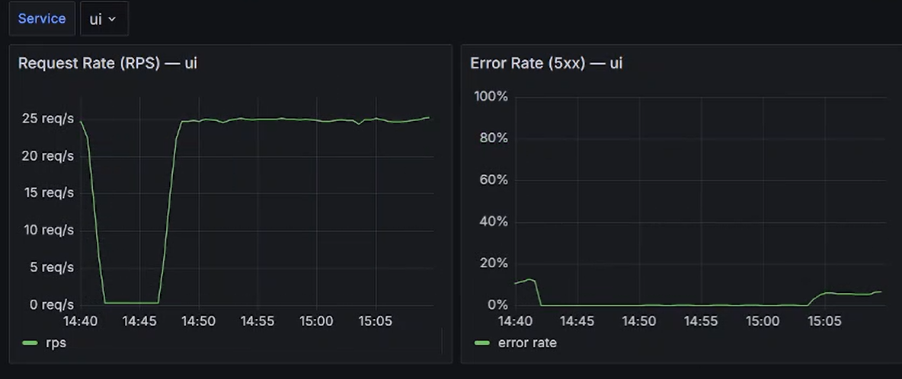
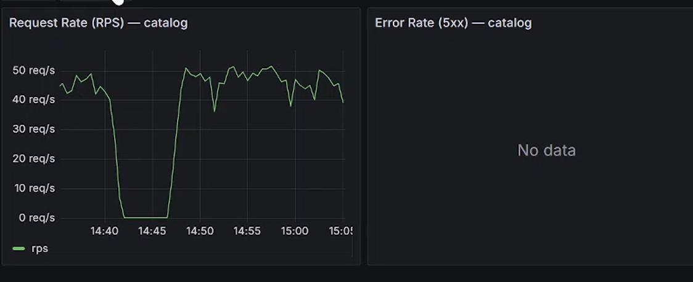
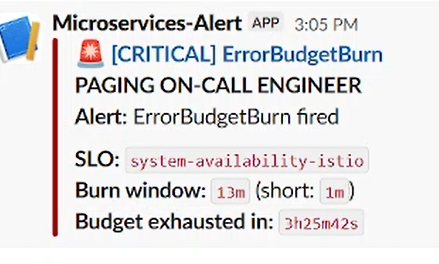

# 04 — Injecting a real fault with Istio

Now the fun part. The baseline is clean (0% failures), so anything that breaks from
here is something I broke on purpose. I used Istio to inject a fault into catalog —
3% of requests get aborted with an HTTP 500 — without touching any code or restarting
any pod. Just a VirtualService.

What happened next is the most interesting thing in this whole walkthrough, and it
caught me off guard at first.

## Injecting the fault

I applied the abort fault to catalog's VirtualService. (The dip to 0 req/s you'll see
in the graphs is me applying it — traffic resumes right after.)

## The surprise: system burns, but catalog stays green

Here's what I expected — I aborted *catalog*, so I assumed *catalog*'s SLO would burn.
That's not what happened:

- `system-availability-istio` (the UI tier): **91.73%**, budget **−8174%**, CRITICAL 🔴
- `catalog-availability-istio` (the catalog tier): **99.99%**, budget **77.52%**, healthy ✓

Catalog is the thing I broke, and catalog looks completely fine. System is on fire.
That seemed wrong until I worked out why.

## Why this happens

Istio injects the abort at the **client-side Envoy proxy** — the sidecar that
intercepts the call as the UI reaches out to catalog. So the request gets killed
*before it leaves the UI's side*. That means:

- **UI sees the 500.** Its metrics record a failed call to catalog. So
  `system-availability` (which queries UI's metrics) burns.
- **Catalog never sees the request at all.** The abort happened on the UI's side, so
  catalog's metrics never log a failed request. So `catalog-availability` (which
  queries catalog's metrics) stays green.

The aborted packet never reaches catalog. That's why the system SLO fires and the
catalog SLO doesn't — even though catalog is the named target of the fault.

## The graphs confirm it

UI's error-rate panel shows a small but real bump — that's where the fault surfaces:

Catalog's error-rate panel says **"No data"** — its own metrics show no 5xx, because
it never received the aborted requests. RPS stays healthy at ~45. Perfectly consistent
with the explanation:

## Locust agrees too

Locust shows ~1% aggregate failures, and they're concentrated in **homepage and
catalog_page** — the two pages that actually call catalog. cart and checkout pages,
which don't touch catalog, show 0 failures. So the failures bubble up exactly along
the call path that goes through catalog, and nowhere else.

## The alert

A critical `ErrorBudgetBurn` fires on `system-availability-istio` — matching the SLO
that actually burned. The alert points at the tier where the user experienced the
failure, not the tier where I injected it.

## So what did I learn?

 I injected a fault into catalog and expected catalog to break — but because Istio aborts client-side, the
failure showed up at the UI tier, not the catalog tier. The two-tier SLO split
(system vs service) actually localized the failure to the *call path*: it told me
"someone calling catalog is failing," not "catalog itself is down." Those are
different problems with different fixes, and the SLO design told them apart. That's
the whole point of having availability SLOs at more than one tier.
