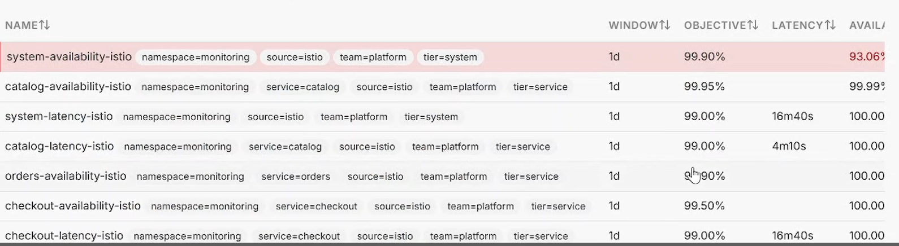
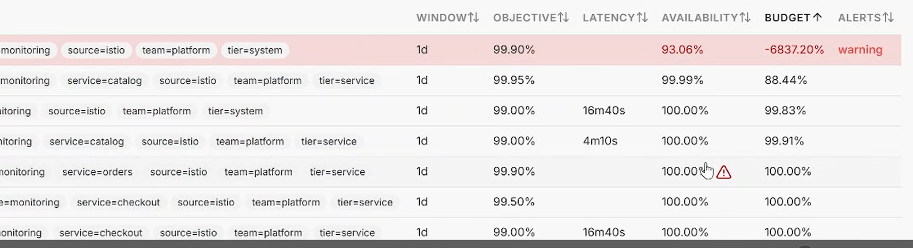
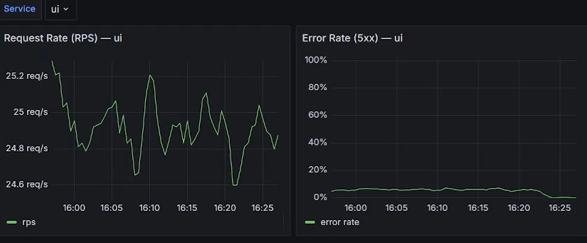
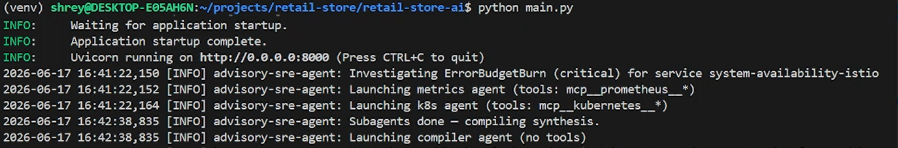
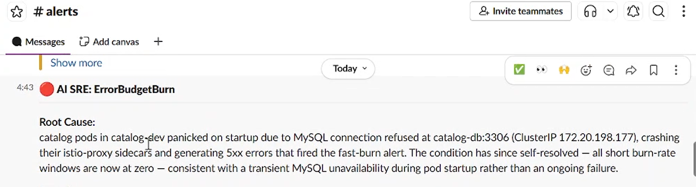
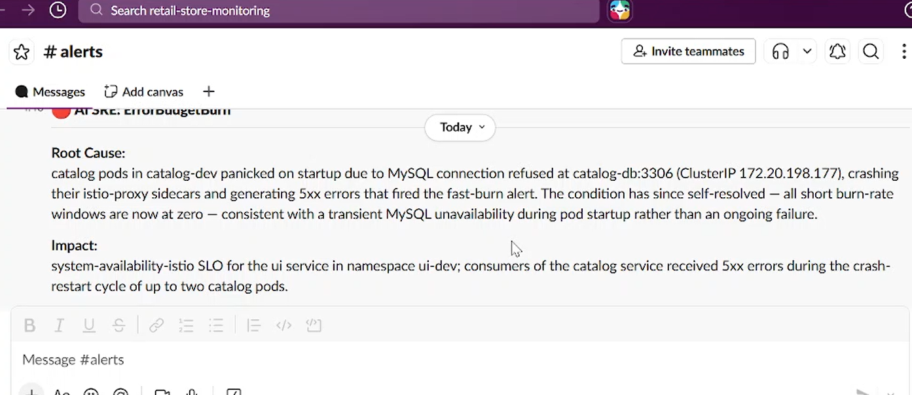
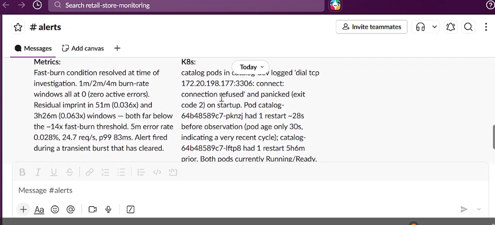
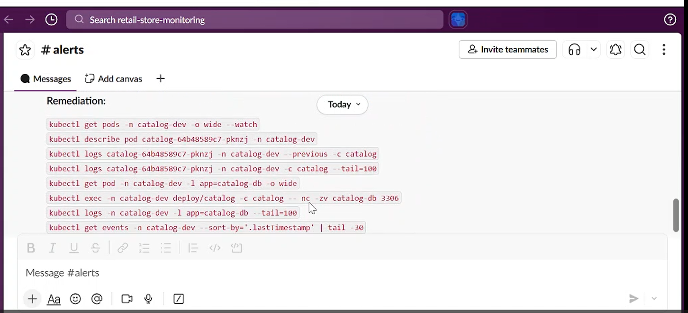

# 05 — An AI SRE agent that investigates the alert

This chapter adds a small AI agent that, when an alert
fires, investigates the live cluster and posts a plain-English diagnosis to Slack —
root cause, evidence, and copy-paste commands a human can run.

It is **advisory and read-only**. It never changes anything. It looks, reasons, and
suggests. A human still decides and acts.

---

## What it is

A small FastAPI service. Alertmanager-shaped alert comes in on `POST /alert`, and the
agent investigates and posts back to Slack. Under the hood it runs several Claude
"subagents" in parallel, each with a narrow job:

- **Metrics agent** — only allowed to query Prometheus. Looks at error rates, request
  rates, burn-rate windows.
- **K8s agent** — only allowed to query Kubernetes. Looks at pods, restarts, events, logs.
- **Compiler agent** — gets the findings from the other two and writes the final
  diagnosis. It has no cluster access at all; it just synthesizes.

They run at the same time (not one after another), then the compiler stitches their
findings into one Slack card.

---

## Why build it

To check the error rate, check which pods restarted, read the recent events, pull
the logs. This agent does that automatically and hands a human a head start —
"here's what I see, here's the likely cause, here are the exact commands to verify."

It does **not** try to fix anything. That's deliberate. An agent that can run `kubectl
delete` in production is a liability. An agent that can only *read* and *suggest* is
useful and safe. Human-in-the-loop on purpose.

---

## How MCP makes this possible 

The agent needs to read Prometheus and Kubernetes. The clean way to give an AI model
that ability is **MCP — the Model Context Protocol**.

I ran a small "MCP server" that already knows how to talk to Prometheus and exposes it as a set of tools the model can call. Same for Kubernetes. The model just says "call the `query` tool with this PromQL," and the MCP server does the actual work and hands back the result.

I added two of them to Claude Code with one command each:

```bash
# a tool server that can talk to Kubernetes
claude mcp add kubernetes -- npx -y kubernetes-mcp-server@latest

# a tool server that can talk to Prometheus
claude mcp add prometheus -e PROMETHEUS_URL=http://localhost:9090 -- npx -y prometheus-mcp-server@latest
```

That's it. Now the model has two new tool-sets: `mcp__kubernetes__*` and
`mcp__prometheus__*`. No custom integration code on my side — the MCP servers handle
the actual API calls.

**The important security bit:** each subagent is locked to just the tools it should
have, using a real flag, not a polite request in the prompt:

```bash
claude -p "...investigate metrics..." --allowedTools "mcp__prometheus__*"
claude -p "...investigate pods..."    --allowedTools "mcp__kubernetes__*"
```

The metrics agent *cannot* touch Kubernetes even if it wanted to — the tool simply
isn't available to it. 

---

## Setting the scene: the fault is off, but the alert is still firing

Before I fired the agent, I'd already turned the fault injection off. The system is
recovering, but on a 1-day window the alert is still firing — the window still
"remembers" the burn from earlier. So this is a great real test: **is the alert still
a real incident, or has it already resolved?**





System availability is climbing back (93%), the UI error rate has dropped back toward
zero — but the alert is still lit. A human glancing at Slack might panic. Let's see
what the agent does.

---

## Firing the agent

I started the agent and posted the alert to it. In the logs you can see the
orchestrator launch the metrics agent and the k8s agent **in parallel**, then launch
the compiler once they finish:



---

## What it posted to Slack

**Root cause** — it didn't just restate the alert, it explained it:



It traced the burn to catalog pods that had crashed on startup (MySQL connection
refused at `catalog-db:3306`), taking their Istio sidecars down with them and
generating the 5xx that fired the alert — and crucially noted the condition had
**self-resolved**, because all the short burn-rate windows are now at zero.

**Impact** — which SLO and which users were affected:



**Per-agent evidence** — this is the part I like. Each subagent's findings are shown
separately, so you can see *where* the conclusion came from:



The **metrics agent** reported the fast-burn windows are all at zero now. The **k8s agent**
independently found the catalog pods had logged `connection refused` to MySQL and
panicked on startup, with recent restarts, but were currently Running/Ready.

**Remediation** — copy-paste commands, never executed by the agent:



---

## The best part: it caught the stale alert

The agent **didn't trust the alert blindly**. It queried live Prometheus, saw the error rate is now 0%, saw the fast-burn windows are zero, and correctly concluded the alert is **stale — the incident already resolved**. It understood *why* the alert is still firing (the long
windows haven't aged out yet) while recognizing there's no active incident.

That's exactly the distinction a good on-call engineer makes — "this is still red, but
it's red because of something that already fixed itself, not because something is
broken right now." The agent reached that on its own, from live data.

---


The agent lives in its own repo: **[retail-store-ai](https://github.com/erysimum/retail-store-ai)**.
